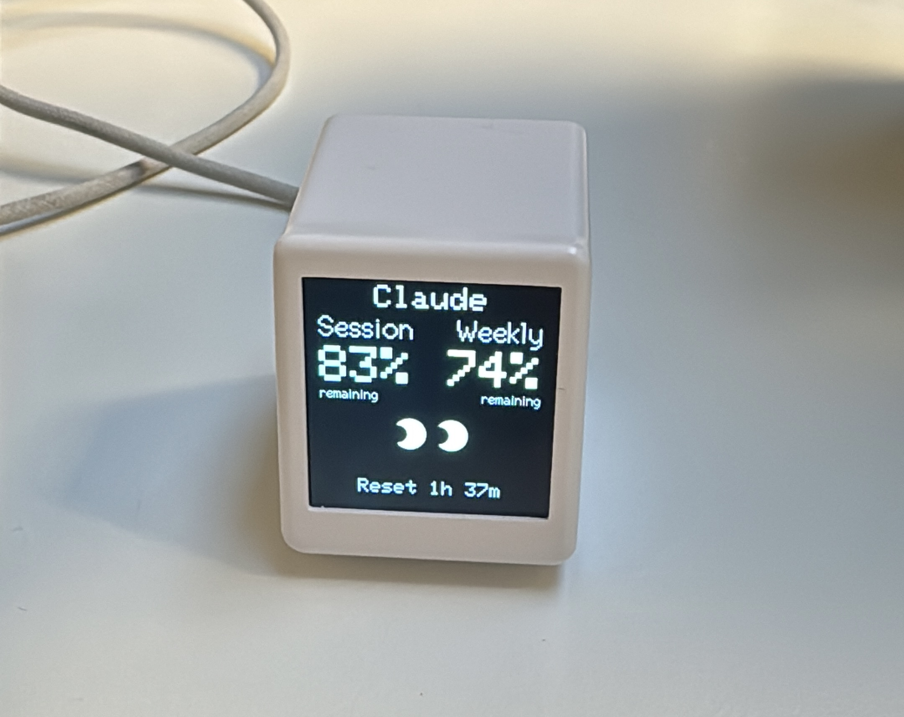

# codexbar-display


`codexbar-display` is the open-source companion + firmware stack for a physical CodexBar status display.

Repository, firmware track, CLI, and release artifacts are all named `codexbar-display`.

## v0 Status
- Pre-release.
- Primary (and only release-gated MVP) hardware target: ESP8266 SmallTV ST7789 (`esp8266_smalltv_st7789`).
- v0 includes built-in themes (`classic`, `crt`, `mini`) and a shared GIF core for scenario-based playback.
- ESP32 (`lilygo_t_display_s3`) remains experimental fallback/non-blocking for v0.

## Theme Previews
### Mini Theme


### CRT Theme


## Quick Start (macOS)
```bash
cd companion

# Optional: build branded local binary for demos
go build -o ../codexbar-display ./cmd/codexbar-display

# Full setup (flash + install + launch agent)
../codexbar-display setup --yes

# Health snapshot
../codexbar-display health
```

If you skip the local binary step, you can still run the same commands via `go run ./cmd/codexbar-display ...`.

## Common Commands
```bash
cd companion

# One-shot runtime test
../codexbar-display daemon --once --port /dev/cu.usbserial-10 --theme mini

# Persist runtime theme
../codexbar-display setup --yes --skip-flash --theme mini

# Upgrade / rollback
../codexbar-display upgrade --firmware-env esp8266_smalltv_st7789
../codexbar-display rollback --port /dev/cu.usbserial-10
```

## Firmware Environments
KISS runtime path:
- `esp8266_smalltv_st7789` (default, release-gated)

Experimental fallback (non-blocking):
- `lilygo_t_display_s3`

Release go/no-go for MVP is gated only by `esp8266_smalltv_st7789`.

Theme selection is runtime-driven (`classic|crt|mini`) via `--theme` or `CODEXBAR_DISPLAY_THEME`.
Protocol contract (v0 target): companion applies `theme` when capability handshake confirms support.
If device hello is temporarily unavailable on the MVP device path, companion falls back to optimistic theme send.

GIF core scenarios on ESP8266:
- `/mini.gif`: mini theme ambient overlay

`classic`/`crt` use no GIF playback at the moment.
The GIF core is request-based so additional theme/event scenarios can be added without reworking decode/retry logic.
Missing or invalid GIF assets automatically fall back to non-GIF UI and enter per-asset retry backoff.

## Theme Precedence
1. `codexbar-display daemon --theme <classic|crt|mini>`
2. `CODEXBAR_DISPLAY_THEME`
3. `~/Library/Application Support/codexbar-display/config.json`
4. Firmware compile default

## Mini Theme Preview (No Flash)
```bash
# From repo root
./scripts/mini-theme-preview.sh
```

This opens a browser preview for the `mini` layout with mocked usage fields and live position/size controls.
Default GIF path is `/firmware_esp8266/data/mini.gif` (served from the repo).

## Development
```bash
# Companion tests
cd companion
go test ./...

# Focused ESP8266 soak gate (theme/reconnect/sleep-wake/24h simulation)
cd ..
./scripts/check-esp8266-soak-gate.sh

# GIF core policy tests (fallback/backoff/request-switching)
./scripts/check-gif-core-policy-tests.sh

# ESP8266 firmware
cd firmware_esp8266
pio run -e esp8266_smalltv_st7789

# ESP32 (experimental)
cd ../firmware_esp32
pio run -e lilygo_t_display_s3
```

## Docs
- Operator runbook: `docs/operator-runbook.md`
- Hardware contract: `docs/hardware-contract.md`
- Open roadmap: `TODO.md`
- Protocol: `protocol/PROTOCOL.md`

## License
Released under the MIT License. See `LICENSE`.
