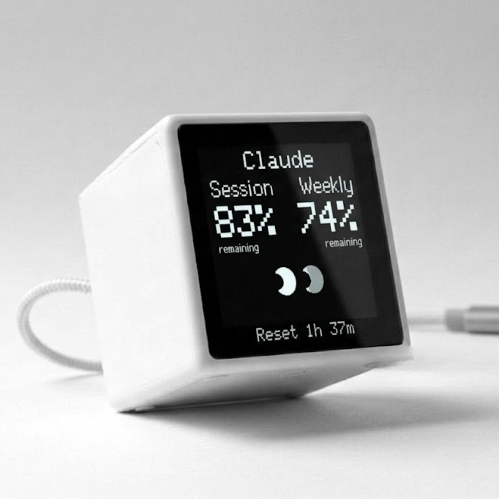
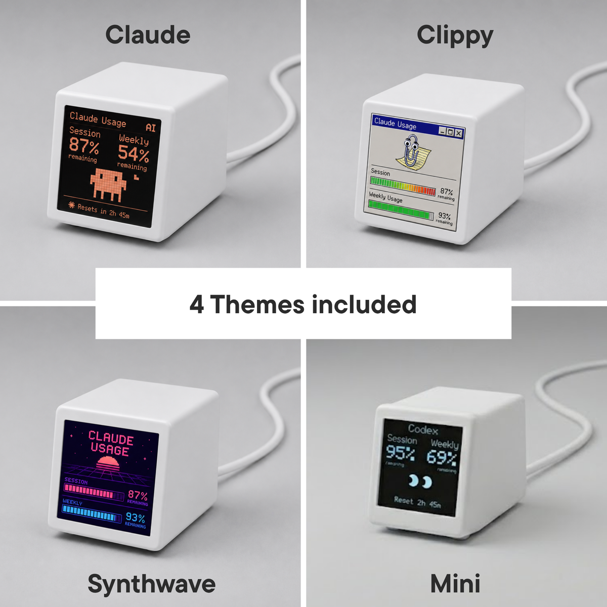
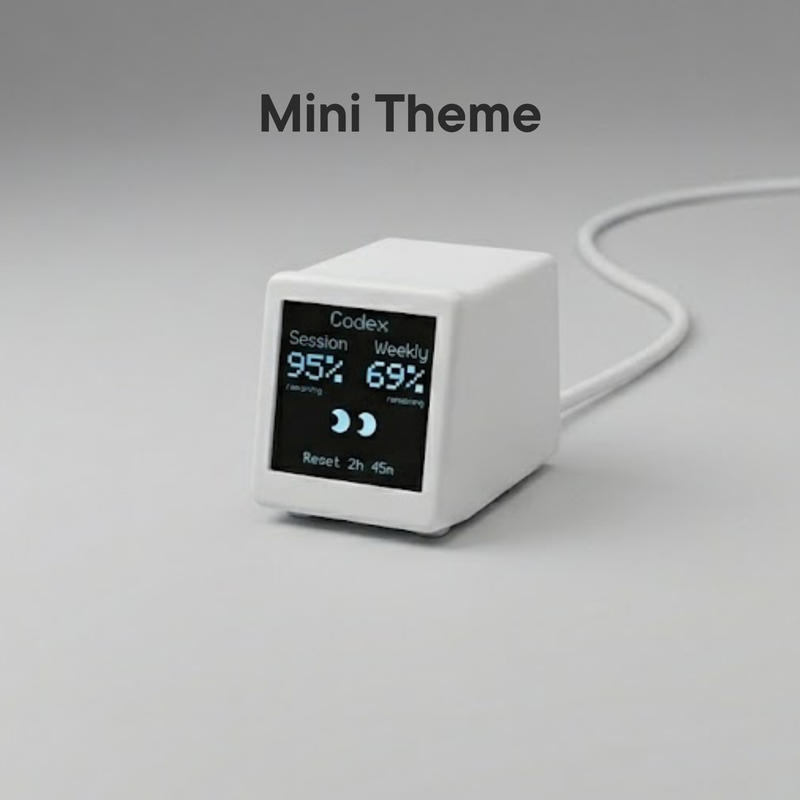
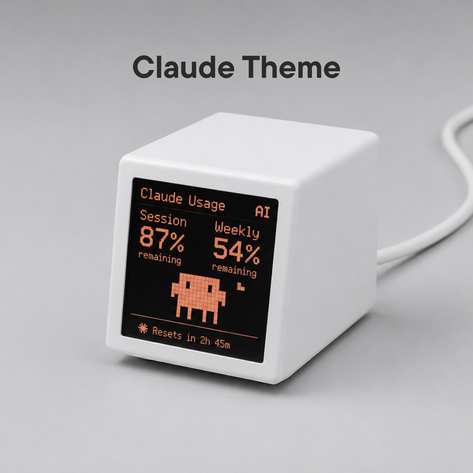
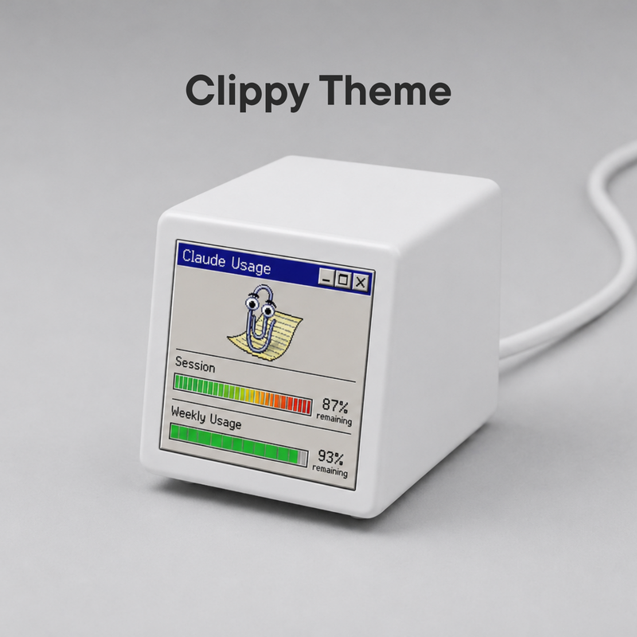
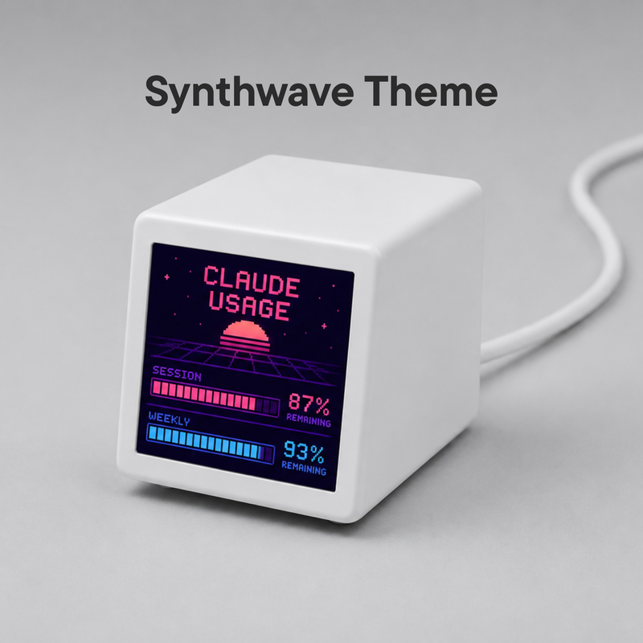

# VibeTV

VibeTV is a physical desk display for AI builders. It keeps usage, limits,
tokens, reset times, and workflow status visible on your desk so you can see
important changes before they interrupt your work.

<p align="center">
  <a href="https://vibetv.shop/products/vibe-tv">
    
  </a>
</p>

<p align="center">
  
</p>

**Start here:** [Buy the hardware](https://vibetv.shop/products/vibe-tv) ·
[Open Control Center](https://app.vibetv.shop) ·
[Setup guide](docs/customer-setup.md) ·
[Themes](docs/themes.md) ·
[Provider support](docs/providers.md)

## Themes

| Mini | Claude Creature | Clippy | Synthwave |
| --- | --- | --- | --- |
|  |  |  |  |

See [docs/themes.md](docs/themes.md) for included themes and custom theme
development.

## Providers

VibeTV can show provider usage surfaced by CodexBar. Common examples include:

- Codex
- Claude / Claude Code
- Cursor
- Gemini
- Antigravity
- Kimi and Kimi K2
- Copilot
- z.ai
- Kiro
- Augment
- Amp
- JetBrains AI
- OpenRouter
- OpenAI / Azure OpenAI
- Mistral, DeepSeek, Moonshot, AWS Bedrock, LiteLLM, and [more](https://github.com/steipete/CodexBar/blob/main/docs/providers.md)

## What It Is

VibeTV is the hardware on your desk. The VibeTV Mac App is the local process
that sends data to the screen. The Control Center at
[`app.vibetv.shop`](https://app.vibetv.shop) is the customer UI for setup,
themes, updates, display settings, support, and usage.

VibeTV is built on top of [CodexBar](https://github.com/steipete/CodexBar) for
AI provider usage data. CodexBar knows how to read usage and quota information
from many AI tools. VibeTV turns that signal into a dedicated physical display.

VibeTV does not generate new provider data in the cloud. It shows the usage
signal that already exists on your Mac: CodexBar reads provider usage locally,
the Mac App turns it into display frames, and those frames go to VibeTV over
your local WiFi. Control Center loads the app, theme catalog, and update
metadata from the web, but normal provider usage is not uploaded to a VibeTV
backend. Support reports are only created when you ask for them.

## What It Shows

- session usage and remaining room
- weekly usage and reset windows
- token counts when the provider exposes them
- active provider and account state
- provider health or stale-data status
- firmware and Mac App update state
- the active theme running on the device

## How It Works

```text
CodexBar on the Mac
  -> VibeTV Mac App on 127.0.0.1:47832
  -> app.vibetv.shop in the browser
  -> VibeTV on the local WiFi
```

1. CodexBar reads provider usage, quotas, tokens, and reset windows.
2. The VibeTV Mac App (`codexbar-display`) reads that data locally.
3. The hosted Control Center talks to the Mac App through the browser.
4. The Mac App sends display frames to VibeTV over local WiFi.
5. VibeTV renders the selected theme on the 240x240 screen.

The normal customer path does not require USB flashing. USB-C powers the device.

## Setup

1. Buy the hardware from [vibetv.shop](https://vibetv.shop/products/vibe-tv).
2. Power VibeTV with USB-C.
3. Join the `VibeTV-Setup` WiFi hotspot and connect VibeTV to your home WiFi.
4. Open [`app.vibetv.shop`](https://app.vibetv.shop) on your Mac.
5. Follow the Control Center setup steps.
6. Install the Mac App through the Agentic setup prompt or the shown Terminal
   command.
7. Allow browser access when prompted, then connect VibeTV.

The customer setup guide is [docs/customer-setup.md](docs/customer-setup.md).

Useful support commands:

```bash
# install or update the Mac App from Control Center
curl -fsSL https://app.vibetv.shop/install-control-center-companion.sh | bash -s -- --terminal-session

# check whether the Mac App is running
curl -fsS http://127.0.0.1:47832/v1/status

# stop the Mac App
curl -fsSL https://app.vibetv.shop/install-control-center-companion.sh | bash -s -- --uninstall
```

## What This Repo Contains

- ESP8266 firmware for the current VibeTV hardware target
- the macOS Mac App / Companion binary `codexbar-display`
- the hosted Control Center app in `apps/control-center`
- the local Companion API used by Control Center
- Theme Studio and theme-pack tooling
- release scripts, firmware manifests, and validation gates
- hardware, setup, provider, architecture, and operator docs

## Documentation

Start with [docs/README.md](docs/README.md).

Important entry points:

- Customer setup: [docs/customer-setup.md](docs/customer-setup.md)
- Architecture: [docs/architecture.md](docs/architecture.md)
- Providers: [docs/providers.md](docs/providers.md)
- Themes: [docs/themes.md](docs/themes.md)
- Theme development: [docs/theme-dev-guide.md](docs/theme-dev-guide.md)
- Control Center readiness: [docs/control-center-customer-readiness.md](docs/control-center-customer-readiness.md)
- Hardware contract: [docs/hardware-contract.md](docs/hardware-contract.md)
- Operator runbook: [docs/operator-runbook.md](docs/operator-runbook.md)
- Protocol: [protocol/PROTOCOL.md](protocol/PROTOCOL.md)

## Local Development

Control Center:

```bash
cd apps/control-center
npm install
npm run dev
```

Mac App / Companion:

```bash
cd companion
go test ./...
go run ./cmd/codexbar-display api --dev-origin http://localhost:3000
```

Customer-flow checks:

```bash
cd apps/control-center
npm run check:customer-ui-copy
npm run test:customer-smoke
```

The full customer-ready gate is:

```bash
scripts/check-control-center-customer-ready-gate.sh
```

### Live Device Safety

The attached VibeTV is not a routine test target. Use unit tests, mocks, and
read-only checks first.

Allowed read-only checks:

```bash
curl http://vibetv.local/hello
curl http://vibetv.local/health
curl http://vibetv.local/assets
```

Do not run firmware updates, theme installs, asset uploads, frame posts, or WiFi
resets against `vibetv.local` or a device IP unless a human explicitly approved
that exact hardware test.

## License

Released under the MIT License. See [LICENSE](LICENSE).
