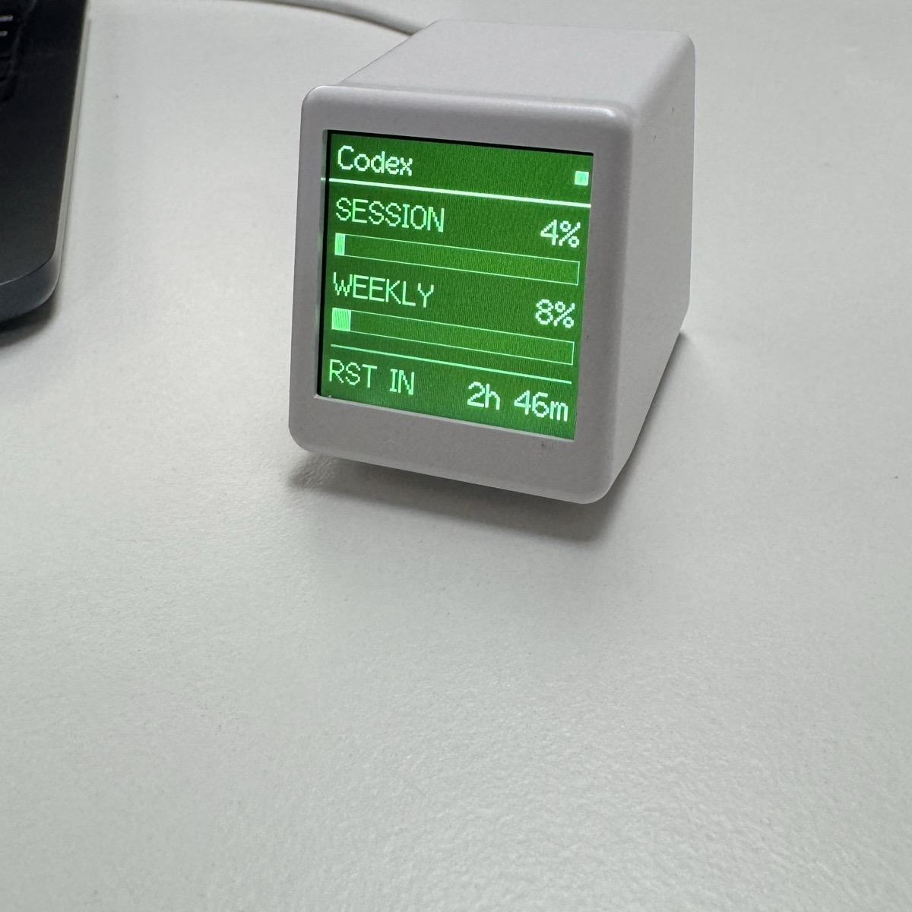

# vibeblock

vibeblock is a physical CodexBar status display for desk use.

It reads local usage data from `codexbar usage --json`, selects one active provider, and renders usage on a USB-connected display.

Core dependency:
- CodexBar: https://codexbar.app/

## UI Preview



## Key Capabilities

- Dual-target firmware support:
  - ESP8266 SmallTV ST7789 profile (default setup target)
  - ESP32 LilyGO T-Display-S3 profile
- Shared firmware core for frame parsing and runtime state across boards
- Device handshake and capability detection (`hello`, board ID, features)
- Companion-side feature gating (for example optional `theme` field)
- Theme system on ESP8266 SmallTV (`classic`, `crt`)
- One-command setup for flash + install + launch agent management
- Runtime hardening for reconnect and sleep/wake workflows

## Architecture

1. `companion` daemon polls `codexbar usage --json`.
2. Provider selection logic chooses one provider deterministically.
3. Companion sends newline-delimited JSON frames over USB serial.
4. Firmware renders the frame on device UI and reports boot capabilities via handshake.

Protocol references:
- `protocol/PROTOCOL.md`
- `protocol/PROTOCOL_V2_DRAFT.md`

## Supported Firmware Environments

- `esp8266_smalltv_st7789` (default)
- `esp8266_smalltv_st7789_crt`
- `esp8266_smalltv_st7789_alt`
- `esp8266_smalltv_st7789_alt_crt`
- `esp8266_probe` (no-display probe profile)
- `lilygo_t_display_s3`

## Theme Support

Two themes currently exist:
- `classic`
- `crt`

Theme support is currently implemented on ESP8266 SmallTV display firmware:
- `esp8266_smalltv_st7789`
- `esp8266_smalltv_st7789_crt`
- `esp8266_smalltv_st7789_alt`
- `esp8266_smalltv_st7789_alt_crt`

Not theme-capable today:
- `esp8266_probe`
- `lilygo_t_display_s3`

### Choosing a Theme

Compile-time default theme comes from firmware environment:
- `*_crt` envs boot with `crt` as default.
- non-`*_crt` envs boot with `classic` as default.

Runtime theme override is controlled by companion env var `VIBEBLOCK_THEME`:

```bash
cd companion
VIBEBLOCK_THEME=crt go run ./cmd/vibeblock daemon --interval 60s
```

Accepted values are `classic` and `crt`. Invalid values are ignored.

Persistent runtime config via setup:

```bash
cd companion
go run ./cmd/vibeblock setup --yes --skip-flash --theme crt
```

If you run via LaunchAgent with manual env vars, add `VIBEBLOCK_THEME` to
`~/Library/LaunchAgents/com.vibeblock.daemon.plist` under `EnvironmentVariables`
and reload the agent.
Note: `vibeblock setup` rewrites this plist; re-apply custom env vars after rerunning setup.

### Developing a New Theme

To add a new theme (for example `amber`), update these parts:

1. `firmware_esp8266/src/main.cpp`
   - extend `enum class Theme`
   - map name in `themeFromName(...)`
   - add theme-specific render functions (splash/usage/error/reset)
   - wire dispatch in `drawSplash`, `tickSplashWaitingDots`, `drawError`, `drawResetCountdownLine`, `drawUsage`
2. `firmware_shared/vibeblock_core.h`
   - allow the new theme name in `ParseFrameLine(...)`
3. `companion/internal/daemon/daemon.go`
   - allow the new value in `configuredTheme()`
4. Optional: `firmware_esp8266/platformio.ini`
   - add a `*_theme` environment with a compile-time default macro (same pattern as `VIBEBLOCK_THEME_CRT`)
5. Docs + protocol
   - document the new theme in this README and `protocol/PROTOCOL.md`

## Quick Start (macOS)

```bash
cd companion

# full setup: validates tooling, flashes firmware, installs binary, configures launch agent
go run ./cmd/vibeblock setup --yes

# health snapshot
go run ./cmd/vibeblock health
```

Common setup variants:

```bash
# skip flashing (already flashed device)
go run ./cmd/vibeblock setup --yes --skip-flash --port /dev/cu.usbserial-10

# explicit ESP32 firmware target
go run ./cmd/vibeblock setup --yes --firmware-env lilygo_t_display_s3 --port /dev/cu.usbmodem101
```

## Operations

```bash
cd companion

go run ./cmd/vibeblock doctor
go run ./cmd/vibeblock health
go run ./cmd/vibeblock restore-known-good --port /dev/cu.usbserial-10
```

Detailed operator procedures (setup, recovery, smoke test, troubleshooting):
- `docs/operator-runbook.md`

## Development

Companion tests:

```bash
cd companion
go test ./...
```

Firmware builds:

```bash
cd firmware_esp8266
pio run -e esp8266_smalltv_st7789

cd ../firmware
pio run -e lilygo_t_display_s3
```

## Repository Map

- `companion/` - Go CLI/daemon (`setup`, `doctor`, `health`, runtime)
- `firmware/` - ESP32 firmware
- `firmware_esp8266/` - ESP8266 firmware and board profiles
- `firmware_shared/` - shared firmware core (parser/state)
- `protocol/` - protocol documentation
- `docs/` - operator and engineering docs
- `scripts/` - backup/restore and smoke scripts

## Documentation Index

- Operator runbook: `docs/operator-runbook.md`
- Provider selection rules: `docs/provider-selection.md`
- Provider activity detectors: `docs/provider-activity-sources.md`
- Milestone test matrix: `docs/m1-test-matrix.md`
- Hardware sourcing checklist: `docs/supplier-hardware-checklist.md`
- ESP8266 spike notes: `docs/esp8266-spike.md`
- Project roadmap: `TODO.md`

## Upstream Hardware References

- ESP8266 supplier firmware: https://github.com/GeekMagicClock/smalltv
- ESP32 supplier firmware: https://github.com/GeekMagicClock/smalltv-pro
- Pinout discussion: https://github.com/GeekMagicClock/smalltv/issues/4
- ESPHome adaptation reference: https://github.com/ViToni/esphome-geekmagic-smalltv
