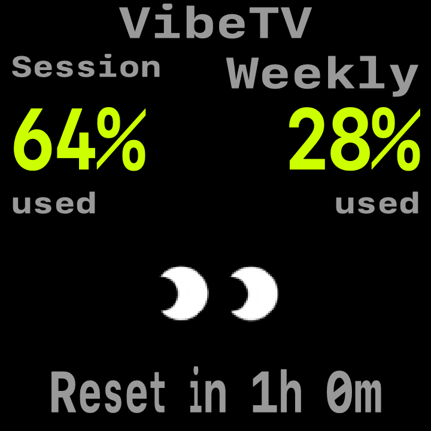
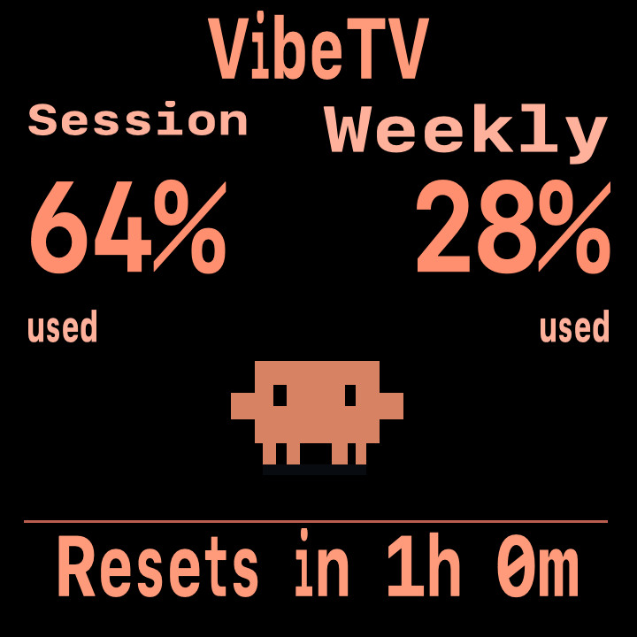
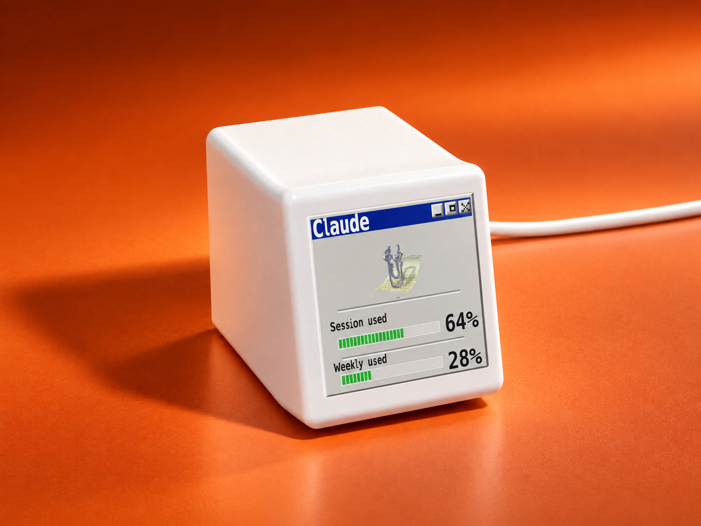
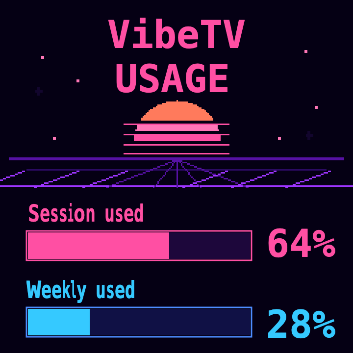
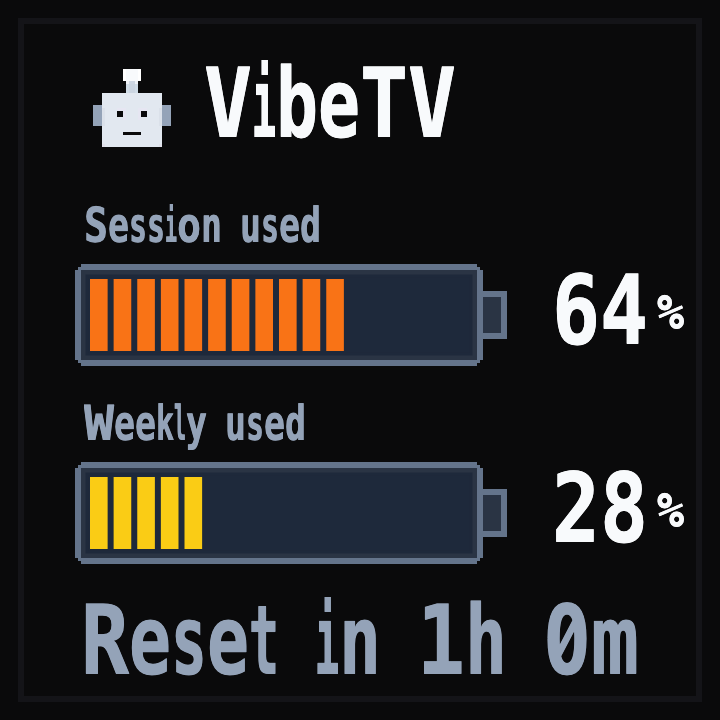
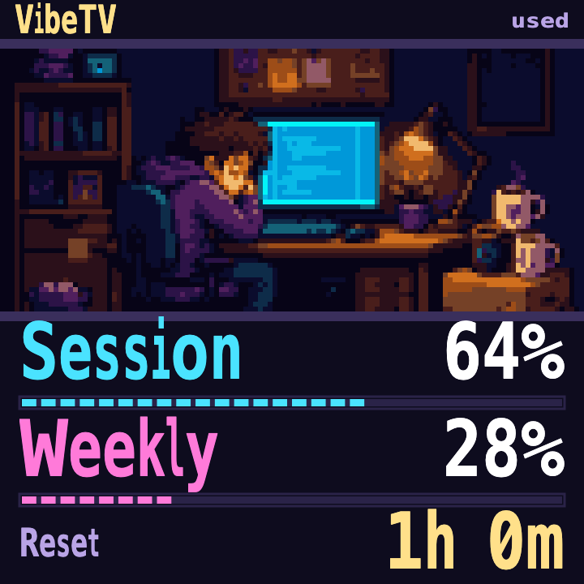
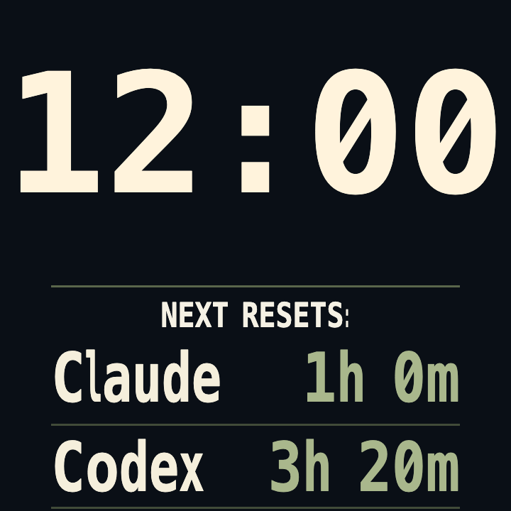
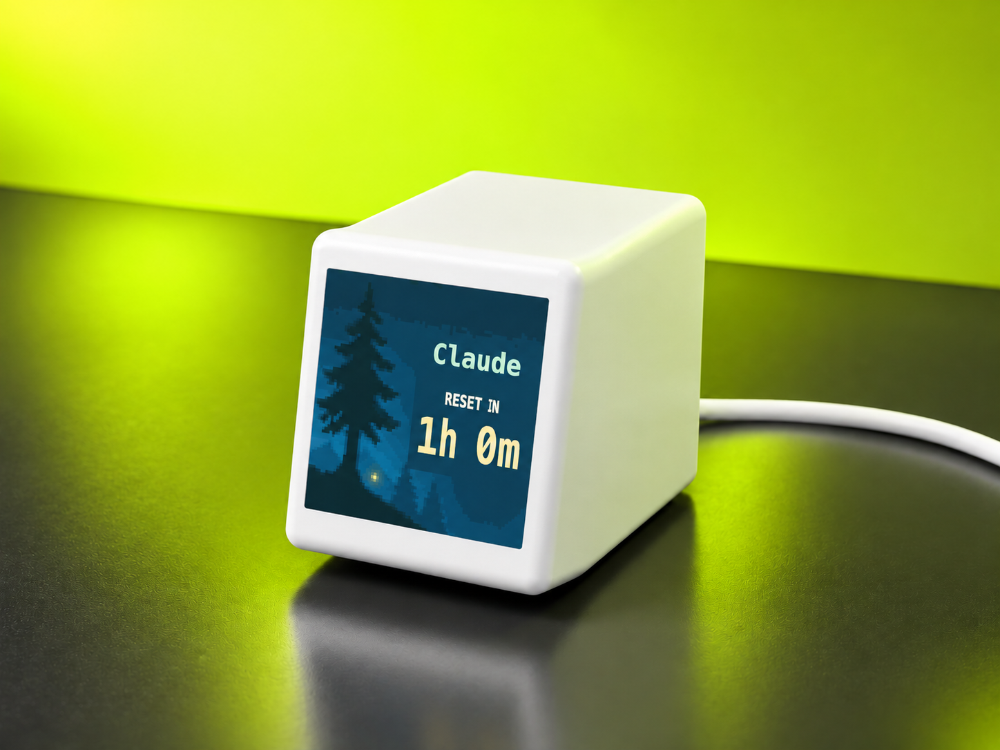
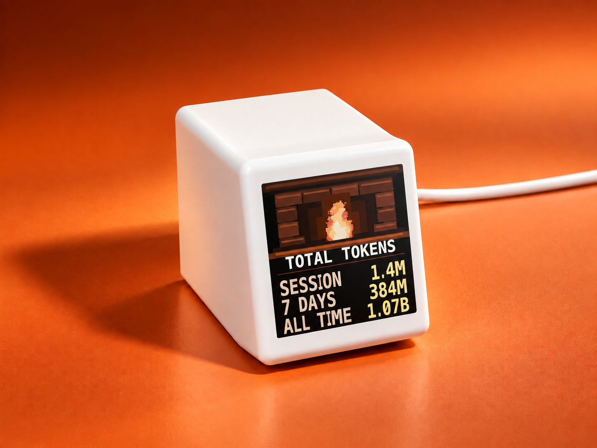

# VibeTV

VibeTV is a physical desk display for AI builders. It keeps usage, limits,
tokens, reset times, and workflow status visible on your desk so you can see
important changes before they interrupt your work.

**Start here:** [Buy the hardware](https://vibetv.shop/products/vibe-tv) ·
[Open Control Center](https://app.vibetv.shop) ·
[Setup guide](docs/customer-setup.md) ·
[Themes](docs/themes.md) ·
[Provider support](docs/providers.md)

## Themes

Six live themes are included. Choose a look in the Control Center Theme Library.

<table>
  <tr><th>Mini Classic</th><th>Claude Creature</th><th>Clippy</th></tr>
  <tr>
    <td align="center"></td>
    <td align="center"></td>
    <td align="center"></td>
  </tr>
  <tr><th>Synthwave</th><th>Pixel Battery</th><th>Tiny Office</th></tr>
  <tr>
    <td align="center"></td>
    <td align="center"></td>
    <td align="center"></td>
  </tr>
</table>

All previews are rendered from the current theme packs with example data.

## Screensavers

Three screensavers are included for standby. Choose one separately from your
live theme in the Control Center Screensavers tab.

| Night Clock | Reset Countdown | Token Fire |
| --- | --- | --- |
|  |  |  |

Screensaver previews use example data. Available values depend on the provider
and data freshness.

See [docs/themes.md](docs/themes.md) for included themes, screensavers, and custom
theme development.

## Providers

VibeTV can show provider usage surfaced by CodexBar. Common examples include:

- Codex
- Claude / Claude Code
- Cursor
- Gemini
- Antigravity
- Kimi and Kimi K2
- Copilot
- z.ai
- Kiro
- Augment
- Amp
- JetBrains AI
- OpenRouter
- OpenAI / Azure OpenAI
- Mistral, DeepSeek, Moonshot, AWS Bedrock, LiteLLM, and [more](https://github.com/steipete/CodexBar/blob/main/docs/providers.md)

## What It Is

VibeTV is a physical device that sits on your desk and shows your AI usage at
a glance: provider, limits, tokens, reset time, and status. It gives the usage
signal a place outside your laptop screen, so you can see where you stand while
you work.

The Mac App sends the local usage signal to the device. The page at
[`app.vibetv.shop`](https://app.vibetv.shop) does exactly one thing: it offers
the signed Mac App download. Everything after that happens in the app on your
own Mac, which walks you through setup and then opens the local Control Center
for themes, display settings, updates, and support.

VibeTV is built on top of [CodexBar](https://github.com/steipete/CodexBar) for
AI provider usage data. CodexBar knows how to read usage and quota information
from many AI tools. VibeTV turns that signal into a dedicated physical display.

VibeTV does not generate new provider data in the cloud. It shows the usage
signal that already exists on your Mac: CodexBar reads provider usage locally,
the Mac App turns it into display frames, and those frames go to VibeTV over
your local WiFi. Control Center loads the app, theme catalog, and update
metadata from the web, but normal provider usage is not uploaded to a VibeTV
backend. Support reports are only created when you ask for them.

## What It Shows

- session usage and remaining room
- weekly usage and reset windows
- token counts when the provider exposes them
- active provider and account state
- provider health or stale-data status
- firmware and Mac App update state
- the active theme running on the device

## How It Works

```text
CodexBar on the Mac
  -> VibeTV Mac App on 127.0.0.1:47832
  -> local Control Center in the browser
  -> VibeTV on the local WiFi
```

1. CodexBar reads provider usage, quotas, tokens, and reset windows.
2. The VibeTV Mac App (`codexbar-display`) reads that data locally.
3. The local Control Center talks to the Mac App through the browser.
4. The Mac App sends display frames to VibeTV over local WiFi.
5. VibeTV renders the selected theme on the 240x240 screen.

The normal customer path does not require USB flashing. USB-C powers the device.

## Setup

1. Buy the hardware from [vibetv.shop](https://vibetv.shop/products/vibe-tv).
2. Power VibeTV with USB-C.
3. Join the `VibeTV-Setup` WiFi hotspot and connect VibeTV to your home WiFi.
4. Open [`app.vibetv.shop`](https://app.vibetv.shop) on your Mac and download the
   Mac App.
5. Drag `VibeTV Control Center` into Applications and open it.
6. The app takes you through setup: choose your VibeTV, choose the AI providers
   to show, choose the display mode, choose a theme. It hands over to Control
   Center by itself when VibeTV is live.

The customer setup guide is [docs/customer-setup.md](docs/customer-setup.md).

Useful support commands:

```bash
# check whether the Mac App is running
curl -fsS http://127.0.0.1:47832/v1/status

# reinstall the Mac App without the download (support fallback)
curl -fsSL https://app.vibetv.shop/install-control-center-companion.sh | bash

# stop the Mac App
curl -fsSL https://app.vibetv.shop/install-control-center-companion.sh | bash -s -- --uninstall
```

## What This Repo Contains

- ESP8266 firmware for the current VibeTV hardware target
- the macOS Mac App / Companion binary `codexbar-display`
- the hosted Control Center app in `apps/control-center`
- the local Companion API used by Control Center
- Theme Studio and theme-pack tooling
- release scripts, firmware manifests, and validation gates
- hardware, setup, provider, architecture, and operator docs

## Documentation

Start with [docs/README.md](docs/README.md).

Important entry points:

- Customer setup: [docs/customer-setup.md](docs/customer-setup.md)
- Architecture: [docs/architecture.md](docs/architecture.md)
- Providers: [docs/providers.md](docs/providers.md)
- Preferences registry: [docs/preferences.md](docs/preferences.md)
- Themes: [docs/themes.md](docs/themes.md)
- Theme development: [docs/theme-dev-guide.md](docs/theme-dev-guide.md)
- Control Center readiness: [docs/control-center-customer-readiness.md](docs/control-center-customer-readiness.md)
- Hardware contract: [docs/hardware-contract.md](docs/hardware-contract.md)
- Operator runbook: [docs/operator-runbook.md](docs/operator-runbook.md)
- Protocol: [protocol/PROTOCOL.md](protocol/PROTOCOL.md)

## Local Development

Control Center:

```bash
cd apps/control-center
npm install
npm run dev
```

Mac App / Companion:

```bash
cd companion
go test ./...
go run ./cmd/codexbar-display api --dev-origin http://localhost:3000
```

Customer-flow checks:

```bash
cd apps/control-center
npm run check:customer-ui-copy
npm run test:customer-smoke
```

The full customer-ready gate is:

```bash
scripts/check-control-center-customer-ready-gate.sh
```

### Live Device Safety

The attached VibeTV is not a routine test target. Use unit tests, mocks, and
read-only checks first.

Allowed read-only checks:

```bash
curl http://<device-ip>/hello
curl http://<device-ip>/health
curl http://<device-ip>/assets
```

Do not run firmware updates, theme installs, asset uploads, frame posts, or WiFi
resets against a device IP unless a human explicitly approved
that exact hardware test.

## License

Source available under the Functional Source License 1.1 with the MIT future
license (FSL-1.1-MIT). The source may be inspected, used, modified, and
redistributed for permitted purposes, but not made available to others in a
competing commercial product or service. Each version becomes available under
the MIT License two years after it is published.

Versions published previously under the MIT License remain available under
the license terms distributed with those versions. See [LICENSE](LICENSE) for
the current terms.
