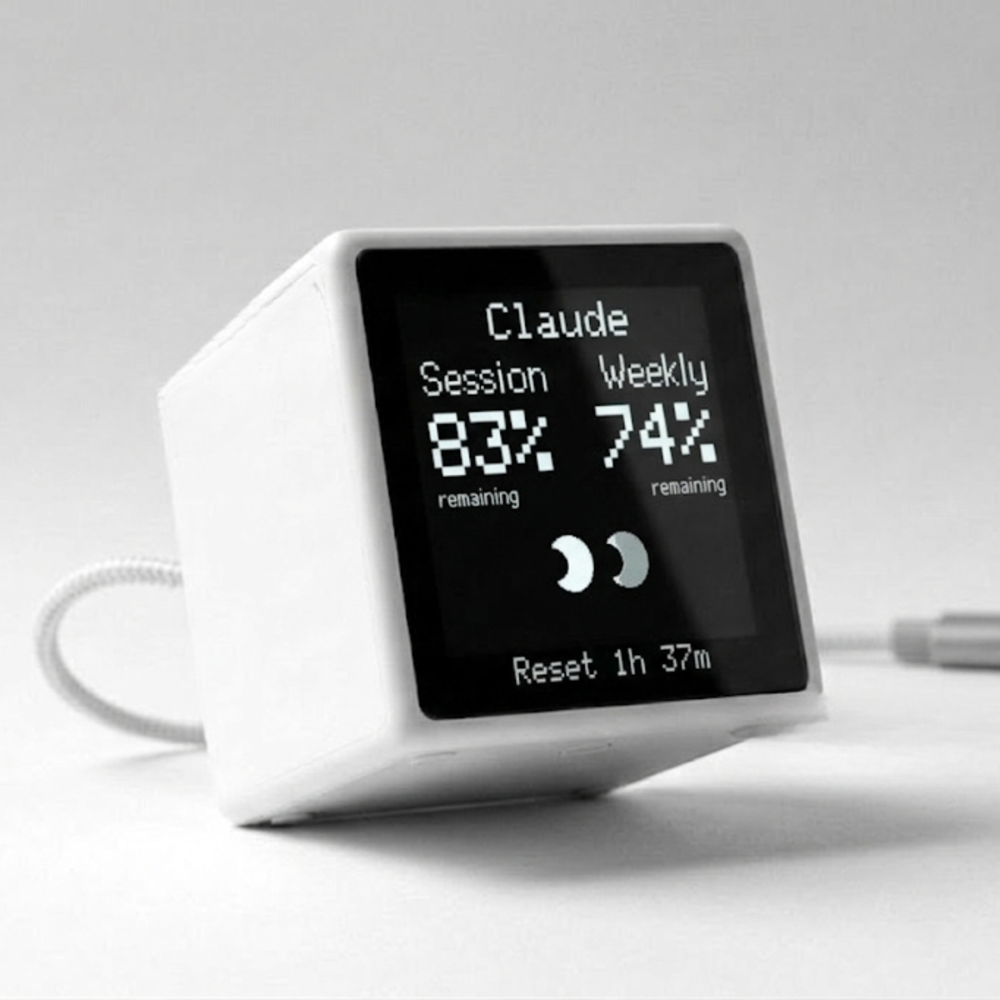

# VibeTV Setup On Mac

This is the normal customer setup for the Control Center launch flow.

You use:

- VibeTV hardware
- USB-C power
- a USB data connection, or a 2.4 GHz home WiFi network
- a Mac
- [app.vibetv.shop](https://app.vibetv.shop)

You do not need USB flashing, PlatformIO, firmware source builds, or the
Terminal for normal setup.

<p align="center">
  
</p>

## What You Are Setting Up

Install the Mac App, then let it guide the connection and display setup.
Current firmware supports Cable operation when your device and cable carry
USB data. WiFi works with power-only connections too.

## 1. Power VibeTV

Plug VibeTV into your Mac with a data cable for Cable operation, or into USB
power for WiFi. Current firmware shows `Download Mac App` and `app.vibetv.shop`.
The setup WiFi runs in the background; you do not need to join it before
opening the Mac App.

Older firmware may show `VibeTV-Setup` instead. It needs WiFi for its first
firmware update; the Mac App guides that path too.

## 2. Open Control Center

On your Mac, open:

```text
https://app.vibetv.shop
```

The page offers the signed Mac App download. That is all it does. It does not
look at your Mac, and it does not manage VibeTV. Everything after the download
happens in the app on your own Mac.

## 3. Install The Mac App

1. Select `Download Mac App`.
2. Open the downloaded DMG.
3. Drag `VibeTV Control Center` to `Applications` and wait for the copy to
   finish.
4. Open `VibeTV Control Center` from `Applications`. If macOS asks, choose
   `Open`.

The app must run from `Applications`. On first open it installs its own
background service, so VibeTV keeps receiving display updates after you close
the app window and again after every login.

The app then opens Control Center locally on:

```text
http://127.0.0.1:47832/control-center
```

If another program already occupies that port, the app picks a different
loopback port by itself.

## 4. Finish Setup In The App

Control Center takes you through six steps, one screen at a time. It moves on
when the step is really done, not when a button was pressed.

1. A welcome screen with nothing to press. It shows what it is doing: starting
   the background service, reading provider usage on this Mac, and looking for
   your VibeTV.
2. The app looks for Cable devices, devices already on your local WiFi, and
   the open `VibeTV-Setup` network. When both connection paths are found, choose
   Cable or WiFi. Select your device if more than one is found. For WiFi, the
   app can send your network details over a working data cable. Otherwise,
   follow its phone WiFi instructions: join `VibeTV-Setup`, open
   `http://192.168.4.1`, and choose your 2.4 GHz network. Return your phone to
   your normal WiFi afterward. Leave VibeTV powered during any required update.
3. `Choose AI providers` — switch on the tools whose usage VibeTV should show.
   At least one has to be switched on and working before you can continue.
4. `Display Mode` — `Automatic` rotates through your providers, `Manual` pins
   the display to one of them.
5. `Choose your theme`, then `Install`. The install runs on the device and
   reports its steps.
6. `Your VibeTV is live`. This screen hands over to Control Center by itself.

If something goes wrong, the app says so in a dialog over the step that caused
it. The step stays visible behind it, so you can see where you are.

## What Success Looks Like

- Control Center says VibeTV is connected.
- VibeTV stops waiting on the setup screen.
- The theme you chose is running on VibeTV.
- Usage appears on the display.
- Overview, Usage, Settings, Appearance, Updates, and Support are available in
  Control Center.

## What The Mac App Does

The Mac App is the `codexbar-display` binary from this repository.

It exists because:

- CodexBar reads AI provider usage on your Mac.
- The Mac App reads that usage from CodexBar.
- Control Center talks to the Mac App locally.
- The Mac App sends screen updates to VibeTV over Cable or local WiFi.

Normal setup and updates never need these. They exist for support:

```bash
# Check whether the Mac App is running.
curl -fsS http://127.0.0.1:47832/v1/status

# Reinstall the Mac App without the download.
curl -fsSL https://app.vibetv.shop/install-control-center-companion.sh | bash

# Restart the Mac App.
curl -fsSL https://app.vibetv.shop/install-control-center-companion.sh | bash -s -- --restart

# Stop the Mac App.
curl -fsSL https://app.vibetv.shop/install-control-center-companion.sh | bash -s -- --uninstall
```

## Display Messages

| Display | Meaning | What to do |
| --- | --- | --- |
| `Starting` | VibeTV is booting. | Wait. |
| `Download Mac App` / `app.vibetv.shop` | VibeTV is ready for setup. | Download and open the Mac App. |
| `SETUP WIFI` / `VibeTV-Setup` (older firmware) | VibeTV needs WiFi setup. | Follow the Mac App’s WiFi instructions. |
| `Connecting WiFi` | VibeTV is joining your home WiFi. | Wait. |
| `WiFi connected!` / `app.vibetv.shop` | VibeTV is on WiFi. | Open Control Center on your Mac. |
| `Open App` / `app.vibetv.shop` | VibeTV is waiting for fresh Mac data. | Open Control Center and connect VibeTV. |
| `Install Mac App` | The Mac App is missing. | Use the setup step in Control Center. |
| `Update Mac App` | The Mac App needs an update. | Use the update step in Control Center. |
| `Update available` | A device update is available. | Open Control Center and follow the update step. |
| `Update running` | VibeTV is updating. | Do not unplug power. |
| `WiFi reset` | Saved WiFi settings are being cleared. | Follow WiFi setup in the Mac App after restart. |

## If Something Does Not Work

- On any setup screen, `Help` offers `Ask AI to fix`, which copies a prompt
  describing your exact situation, and `Create support report`. Try that before
  any command below.
- If Control Center says the Mac App is not running, make sure `VibeTV Control
  Center` is in `Applications` and open it again.
- If Control Center cannot find VibeTV over Cable, check that the cable carries
  data. For WiFi, follow the setup instructions or make sure both devices are
  on the same local network.
- If `.local` does not work, use the IP address shown on VibeTV.
- If the app asks for WiFi setup, complete its instructions and scan again.
- If the app shows one clear action, use that action before trying support
  commands.

## Change WiFi

Use Settings to switch between Cable and WiFi. When network details are
needed and USB data is available, enter them in the Mac App. Otherwise, if
VibeTV cannot reconnect to its saved network, wait for the `VibeTV-Setup`
network to appear. Join it on a phone, open `192.168.4.1`, and choose
the new 2.4 GHz network. This changes only the WiFi name and password. Existing
pairing, themes, brightness, and other VibeTV settings stay unchanged.

An authenticated WiFi reset remains available as an explicit support action
while the paired VibeTV is reachable. It is not needed for a normal WiFi change.

## Important

- Normal setup is macOS-first.
- Cable operation requires a working USB data connection and current firmware.
- Firmware 1.0.41/1.0.42 needs WiFi for its first update, even on USB-capable hardware.
- USB flashing is only for support and development.
- Firmware updates, theme installs, WiFi resets, and asset uploads are hardware
  write actions. They should happen only through the intended Control Center
  flow or during an approved support test.
