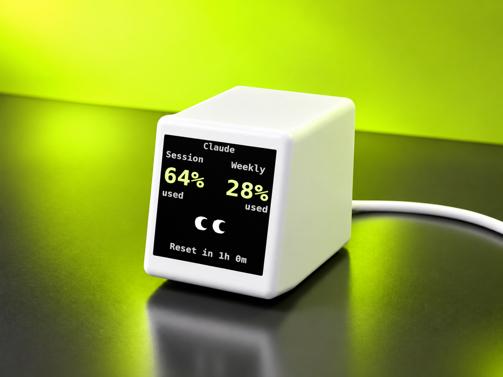
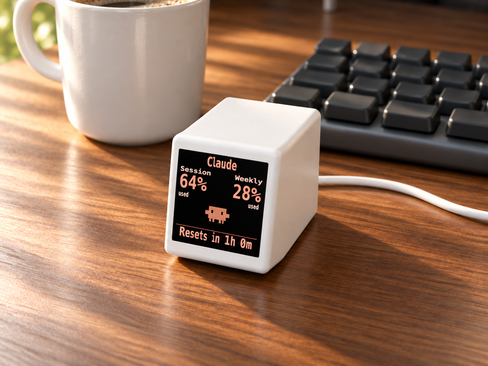

# VibeTV Themes

Themes decide how live VibeTV data appears on the device. The same provider
usage can look compact, playful, retro, or highly information-dense depending
on the active theme.

## Included Themes

The current catalog includes six live themes:

| Theme | Preview | Notes |
| --- | --- | --- |
| Mini Classic |  | Compact provider, session, weekly, and reset display. |
| Claude Creature |  | Character-style usage display. |
| Clippy |  | Animated assistant-style theme with live usage bindings. |
| Synthwave |  | Neon skyline and usage bars. |
| Pixel Battery |  | Segmented batteries show usage for two windows. |
| Tiny Office |  | Pixel-art developer desk with an animated monitor; idle and coding scenes. See [tiny-office-theme.md](tiny-office-theme.md). |

## Included Screensavers

Screensavers occupy a separate standby slot, so choosing one keeps your live
theme selection. The current catalog includes:

| Screensaver | Preview | Notes |
| --- | --- | --- |
| Night Clock |  | Clock and upcoming provider resets. |
| Reset Countdown |  | Forest scene with a provider reset countdown. |
| Token Fire |  | Animated fireplace with token totals. |

Product renders use illustrative example data. Pixel Battery and Tiny Office
show screen previews rendered from the current theme packs. Available usage,
reset, and token values depend on the provider and data freshness.
See [image sources](assets/README.md) for render provenance.

The Mac App ships the matching repository catalog and theme packs in its local
Control Center bundle. Shopify theme products are not part of this install path.

## Customer Flow

1. Open [Control Center](https://app.vibetv.shop).
2. Complete setup if the Mac App or VibeTV is not connected.
3. Open Theme Library.
4. Choose a theme.
5. Select install.

The Mac App uploads the theme assets to VibeTV over local WiFi and activates the
stored ThemeSpec. After that, the Mac App keeps sending live usage values to the
same active theme.

Overview resolves its preview by the exact active ThemeSpec path and the
firmware-reported ThemeSpec fingerprint. The Mac App bundles render packs for
known current and frozen legacy revisions. Every theme installed through the
Companion, including a Custom Theme, is cached per revision with its assets so a
later edit of the same theme ID cannot replace the preview of the revision still
running on VibeTV. The Companion keeps the newest 12 revisions per theme, so
repeated edits cannot grow the preview cache without bound. New Mac Apps also
fall back to the exact-path metadata exposed by older Companions.

Theme Library is intentionally different from Overview: its thumbnails and
large preview use short neutral `Session` and `Weekly` example values. The large
preview labels those values as example data. It does not claim to show the
connected VibeTV or a particular provider.

Theme install and firmware update are separate actions. Installing a theme
should not silently run a firmware update.

## Theme Packs

A theme pack is the installable unit for customer themes. Source files live in:

```text
theme-packs/<theme-id>/
```

Published artifacts live in:

```text
dist/theme-packs/
```

The current app-generation catalog is:

```text
dist/theme-packs/vibetv-theme-packs-v2.json
```

`vibetv-theme-packs.json` and its unversioned ZIPs are the frozen legacy
generation for already shipped Mac Apps and Companion binaries.

See [theme-packs.md](theme-packs.md) for the pack format and CLI commands.

## Building Themes

Theme Studio now lives inside the local Control Center served by the Mac App.
Open Control Center, choose **Theme Library**, then create a new theme or edit
an existing one. Theme Studio can create a local draft, open ThemeSpec JSON,
edit the 240x240 layout, validate it, export an installable theme-pack ZIP, and
send the current theme to VibeTV from an explicit **Send to VibeTV** action.
The Mac App performs the same device, pairing, capability, upload, and render
checks as every other theme install.

The AI-assisted builder is intentionally not part of the first Theme Studio
release. It needs a separate security design before it can be enabled.

Theme Studio can:

- edit 240x240 layouts
- import sprites and GIFs in the local Control Center
- preview usage bindings with neutral example values
- export theme packs from Control Center without an automatic hardware write
- install the generated pack through the Mac App only after the customer clicks
  **Send to VibeTV**

For reliable hardware themes, keep static visual detail in streamed assets and
keep ThemeSpec JSON focused on live fields. Start with
[theme-dev-guide.md](theme-dev-guide.md) before publishing a customer theme.

## Hardware Safety

Theme install writes to the device. During development, use local validation and
read-only checks before installing themes on real hardware.

Allowed read-only checks:

```bash
curl http://<device-ip>/hello
curl http://<device-ip>/health
curl http://<device-ip>/assets
```

Do not upload assets, activate themes, reset WiFi, or run firmware updates on a
live VibeTV unless that exact hardware test was explicitly approved.
