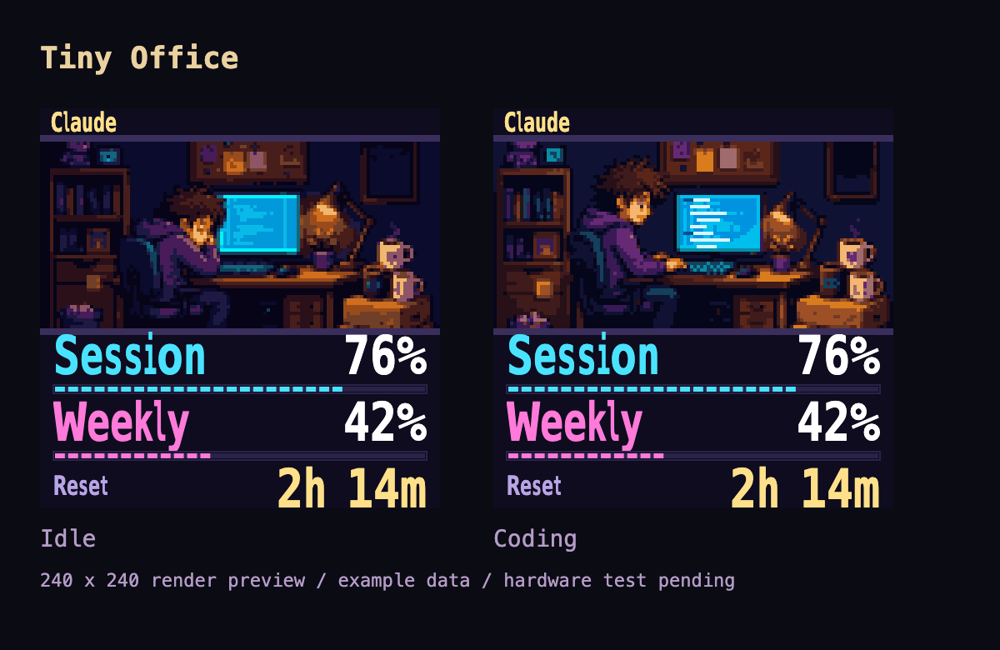

# Tiny Office

Tiny Office is a provider-neutral live theme for the 240x240 VibeTV display.
It uses the existing idle/coding activity signal to select two office scenes,
each with a small animated window around the developer's monitor. It does not
infer activity or fatigue from quota consumption and does not introduce a new
firmware primitive or provider integration.

## Source and build

- Layout: `theme-packs/tiny-office/theme.json`.
- AI artwork: `docs/assets/tiny-office/idle.png` and `coding.png`. The
  compiler grades the night-office reference brighter and more saturated for
  the small panel and drops the ceiling/floor rows so the numbers get a large
  font.
- Device assets and checksummed manifest: generated by
  `scripts/build-tiny-office-theme.mjs`.
- Installable ZIP and exact render pack: generated by the existing
  `scripts/build-theme-packs.mjs` pipeline.

```sh
npm ci --prefix apps/control-center
node scripts/build-tiny-office-theme.mjs
node scripts/build-theme-packs.mjs
node scripts/test-theme-pack-release-flow.mjs
./scripts/check-theme-pack-history.sh
npm --prefix apps/control-center run build:local
```

Before changing a published version, bump the version in the compiler and
`rev` in the ThemeSpec. Do not replace an existing published ZIP or revision.

## Runtime

- Exactly one `label` binding carries the provider display name and firmware
  update notices. The used/remaining mode is intentionally not displayed.
- Two slot-bound lanes show the actual window names and percentages. Missing
  slots are hidden by the existing renderer; no synthetic windows are added.
  Labels, percentages and the reset time use TFT_eSPI font 2 at size 2 (32 px)
  with fit shrink, so long CodexBar window names such as `Codex Spark Weekly`
  and `Reset unavailable` drop to size 1 instead of being clipped. The test
  measures those exact values against the firmware font metrics.
- The reset row uses slot 1's reset binding, without duplicating the renderer's
  unavailable message or inventing a reset time.
- `stateAssets` swaps the whole office scene for `idle` versus `coding`,
  and a second sprite swaps the matching CBA1 animation on top of it.
- Animation: one 40x32 source window (drawn 80x64, the firmware's CBA buffer
  limit is 80x80) at 4 fps. Coding: a redrawn code listing on the monitor
  scrolls upward in a seamless 16-frame loop while the hands tap. Idle: the screensaver face drifts
  and blinks in an 8-frame loop while the body breathes. Frames are derived
  from the scene pixels themselves, so the overlay is seamless and uses the
  same palette. Only this window repaints; the rest of the scene stays static.
- Three static CBI1 files plus two CBA1 files, 26 colors maximum. Scene source
  dimensions are 120x56, drawn at 240x112; the full-canvas background is 60x60,
  drawn at 240x240. Each static asset is below 10,000 pixels.
- Twelve primitives, 1,409 source ThemeSpec bytes, 8,147-byte v0.4.0 ZIP.

## History

- v0.4.0 (rev 5): font 2 at size 2 with shrink for long slot names, scene
  cropped to 112 px. First published revision.
- v0.3.0 (rev 4), v0.2.0 (rev 3), v0.1.0 (rev 2): drafts, never published.

## Verification and visual preview

Run the actual Control Center renderer tests and request preview SVGs:

```sh
cd apps/control-center
VIBETV_THEME_PREVIEW_DIR=../../tmp/tiny-office-preview npm run test:unit -- src/theme-packs/tiny-office-theme.test.ts src/components/live-vibetv-preview.test.ts src/lib/theme-studio.test.ts src/lib/theme-studio-assets.test.ts
npm exec -- playwright install chromium
cd ../..
node scripts/preview-tiny-office-theme.mjs
```

The preview script captures the SVG produced by `ThemeSpecPreview` in a browser,
at native 240x240 CSS-pixel size. It does not use a separate mock renderer.
Preview numbers are explicitly example data, not a live device reading.



Local checks: source/ZIP validation, catalog/checksum/immutable-history checks,
59 targeted tests, and the local Control Center production build passed.

## Hardware acceptance

Bench device: esp8266-smalltv-st7789, firmware 1.0.41, installed with the
user's explicit approval through the Companion (`POST /v1/themes/install`,
slot `live`). The v0.2.0 and v0.3.0 drafts and the published v0.4.0 (rev 5,
`/themes/u/to-5-286c9cc0.json`) were installed and observed over `/health`:

- `renderOk: true`, `renderFailures: 0`, no reboot (`bootId` unchanged).
- CBA animation running: `cbaCompletedFrames` advancing ~3.6/s at 54 ms per
  frame, `cbaBufferBytes: 10240`, `cbaBufferAllocationFailures: 0`.
- Heap stable at ~13.2 KB free / 10.0 KB max block across all samples, above
  the firmware's animation minimums (8 KB / 3 KB).
- The user judged the real screen: values readable, colors strong enough,
  animation as intended.

Not yet done: a 10–20 minute soak and repeated theme switches
(synthwave → tiny-office → synthwave). Any further hardware write needs a new
explicit approval for that exact test; do not flash firmware or run cold/warm
customer rehearsals as an implicit theme smoke test.

## Artwork provenance

The built-in image generation tool edited the user-approved Tiny Office
concept into two source scenes. No CLI/API fallback was used.

Shared prompt:

Use case: precise-object-edit. Input image: reference and edit target, the user-approved Tiny Office design. Produce a game-ready pixel-art SCENE ASSET for its real 240x240 device theme. Remove the entire title and entire bottom stats/UI area and ALL lettering, numbers, speech symbols and posters containing text. The output is ONLY a landscape office scene at aspect ratio 3:2, edge to edge, no outside margins, no hardware mockup. Preserve the same original cozy purple-hoodie developer, messy brown hair, cyan monitor, amber desk lamp, little green plant, coffee cups and two pizza boxes, muted navy-purple room, wood desk, front-facing dollhouse composition. Simplify deliberately so it remains recognizable at 120x80 pixels. Large coherent pixel clusters, limited 24-color feeling, soft midtone transitions, not high-contrast noise. Keep all content in frame including feet and desk. Strong character silhouette on left-center, glowing monitor near center-right, coffee and pizza on right. Background fills the whole rectangle. No text anywhere, no fake usage numbers or meter. This asset will have real dynamic text rendered OUTSIDE it by firmware.

Idle state: Developer resting with eyes closed, head on one hand; softly glowing
monitor, calm mood, no Z symbols.

Coding state: Same developer awake and upright with both hands on the keyboard,
focused friendly expression, cyan monitor with abstract code strokes.

Device compilation follows the repository guide: a single box-averaged
reduction, restrained palette quantization without dithering, CBI1 row encoding,
and 2x nearest-neighbor device rendering. Original AI images stay unchanged.
